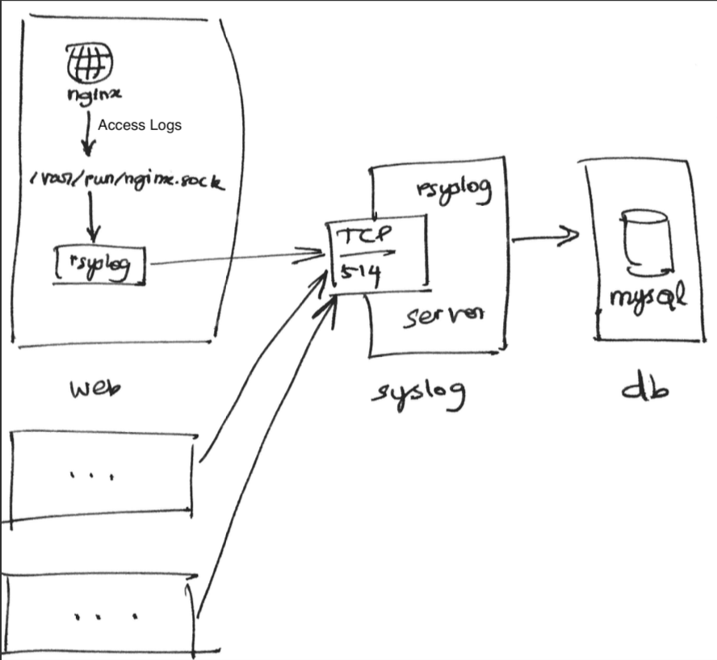

# EBI OPS Challenge

## Quick Run
1. Clone this repository
    ```bash
    git clone https://github.com/ssurenr/ebi-ops-challenge.git
    cd ebi-ops-challenge
    ```
2. Bring up containers using docker compose
    ```bash
    docker-compose up -d
    ```
3. Start rsyslog agent in the web container
    ```bash
    docker exec -it ebi-ops-challenge_web_1 /etc/init.d/rsyslog start
    ```
4. Generate some traffic.
    ```bash
    curl localhost:8080
    ```
5. View the access logs from MySQL
    ```bash
    mysql -u rsyslog -h 127.0.0.1 rsyslog -e "SELECT Message FROM SystemEvents;" -prsyslog
    ```

## Caveats
:warning: This solution works in Docker for MacOS. If you want to run on linux or windows, replace `docker.for.mac.host.internal` domain to your host's ip address in the following files before executing step 2 above.
1. [nginx/rsyslog.conf](nginx/rsyslog.conf).  
2. [syslog-server/ommysql.conf](syslog-server/ommysql.conf).  

:warning: If the web container need to be scaled, step 3 should be run for each web container. This should have been automated. However, Docker is only used to simulate the real environment. Docker is chosen to quickly bring up this solution without much effort in evaluator's environment.

## Architecture



## Clean Up
```bash
docker-compose down
docker volume rm ebi-ops-challenge_db_data
```
